<p align="center">
    <a href="/">
        
    </a>
    <a href="https://www.djangoproject.com/">
        
    </a>
    <a href="https://getbootstrap.com/">
        
    </a>
    <a href="https://github.com/mahmudahsan/pythonbangla.com/blob/master/LICENSE">
        
    </a>
    <a href="https://twitter.com/mahmudahsan">
        
    </a>
</p>

# pythonbangla.com
A dynamic content management system for publishing youtube videos and blog post in a single page web application.
I developed this web app to place all my youtube video tutorials and related blog post links in one place.

Demo 1 🤓: [Django + PostgreSQL + Heroku](https://pb-947583-bn474.herokuapp.com) | Source Code: [Github Django](https://github.com/mahmudahsan/pythonbangla.com)

Demo 2 😎: [React + Firebase](http://pythonbangla.com) | Source Code: [Github React](https://github.com/mahmudahsan/python-bangla-react)

## 🔥 I developed a React and Firebase based similar project. Checkout the React based project's source code [https://github.com/mahmudahsan/python-bangla-react](https://github.com/mahmudahsan/python-bangla-react)

## Usage
If you know django, postgresql, bootstrap you can easily modify html template and backend according to your project needs. But if you just want a site like the demo [Pythonbangla.com](http://pythonbangla.com) you can change the images in static directory in the project, and add contents from your or your client's youtube channel or blog post. To know how to setup, follow the table of contents.

### Other Python Projects
- [Bank Rates](https://github.com/mahmudahsan/bankrates)
- [Python Tutorials](https://github.com/mahmudahsan/thinkdiff)

# Table of Contents

- [Technology Used](#technology-used)
- [Features](#features)
- [Setup in local machine](#setup-in-local-machine)
- [Setup PostgreSQL in local machine](#setup-postgresql-in-local-machine)
- [How to use admin panel to manage contents](#how-to-use-admin-panel-to-manage-contents)
- [Setup Amazon S3 CDN to upload static content](#setup-amazon-s3-cdn-to-upload-static-content)
- [Setup And Running in Heroku without static content](#setup-and-running-in-heroku-without-static-content)
- [Setup And Running in Heroku with static content](#setup-and-running-in-heroku-with-static-content)
- [How to force https in django](#how-to-force-https-in-django)
- [Contribution](#contribution)
- [Questions or feedback?](#questions-or-feedback)

## Technology Used
1. [Django](https://www.djangoproject.com/)
2. [PostgreSQL](https://www.postgresql.org)
3. [Bootstrap](https://getbootstrap.com/)
4. [JQuery](https://jquery.com/)
5. [Linkyfy](https://github.com/cowboy/javascript-linkify)

## Features
1. Responsive single page webapp
2. Admin Panel for content management
3. Automatic playlist created based on content
4. Mainly developed for youtube videos
5. Blog post or external link list also supported
6. Youtube video description also can be added from admin panel
7. In description, link automatically converted to hyperlink
8. In Admin easy way to add javascript code within head tag
9. Easy way to add Google Analytics or Google Adsense auto ads

## Setup in local machine

Let assume our project name will be djangodemo

1. First clone this project or fork and clone your fork url
```shell
git clone https://github.com/mahmudahsan/pythonbangla.com.git djangodemo
cd djangodemo # Enter the project dir
```

2. Now run and install django by [pipenv](http://thinkdiff.net/python/python-official-pipenv-packaging-tool-for-virtualenv-and-pip-in-mac-and-windows/)

```shell
pipenv install django
pipenv shell # Activate pipenv
```

### Setup PostgreSQL in local machine

1. Downlaod and install [PostgreSQL](https://www.postgresql.org/download/) 
2. Run the PostgreSQL in your machine
3. Download [pgAdmin](https://www.pgadmin.org) if you prefer managing PostgreSQL visually
4. Run pgAdmin to create database visually
5. Or Create a database in PostgreSQL in terminal
6. Update django frameworks's project settings djangodemo/pythonbangla_project/settings.py

```Python
DATABASES = {
    "default": {
        "ENGINE": "django.db.backends.postgresql",
        "NAME": "YOUR_LOCAL_DB_NAME",
        "USER": "YOUR_POSTGRESQL_USER_NAME",
        "PASSWORD": "YOUR_POSTGRESQL_PASSWORD",
        "HOST": "localhost", 
        "PORT": "5432", # usually this port unless your port is different
    }
}
```
7. Apply database migration from django to postgresql
This will convert all the models to SQL tables in postgresql

```shell
python3 manage.py migrate
```

8. Start django server locally
```shell
python3 manage.py runserver
```

9. Visit http://127.0.0.1:8000/ in a web browser. You will see the following blank webpage without any contents
<p align="center">
    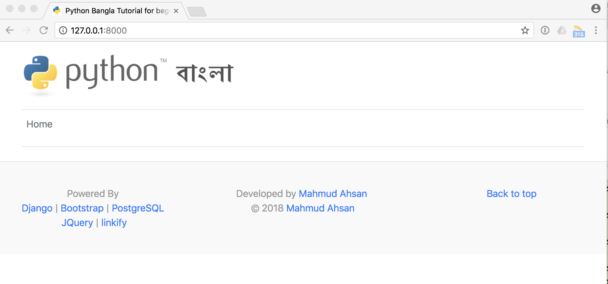
</p>	

10. Quit the server with CONTROL-C in terminal 
```shell
CONTROL-C
```

## How to use admin panel to manage contents

1. First create a superuser
```shell
python3 manage.py createsuperuser
```
2. Now run the server again
```shell
python3 manage.py runserver
```
3. Now in web browser visit http://127.0.0.1:8000/admin . Login with the superuser name and password you created already.

You will see the following admin panel with 4 tables
<p align="center">
    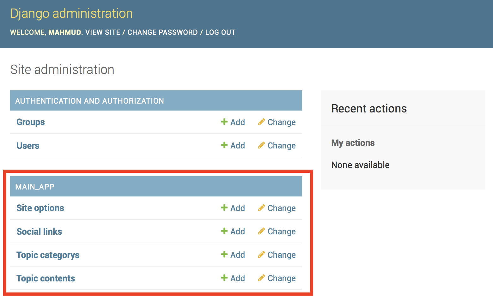
</p>	

4. Now add a topic category. Click the [+ Add] button

You will see the following form
<p align="center">
    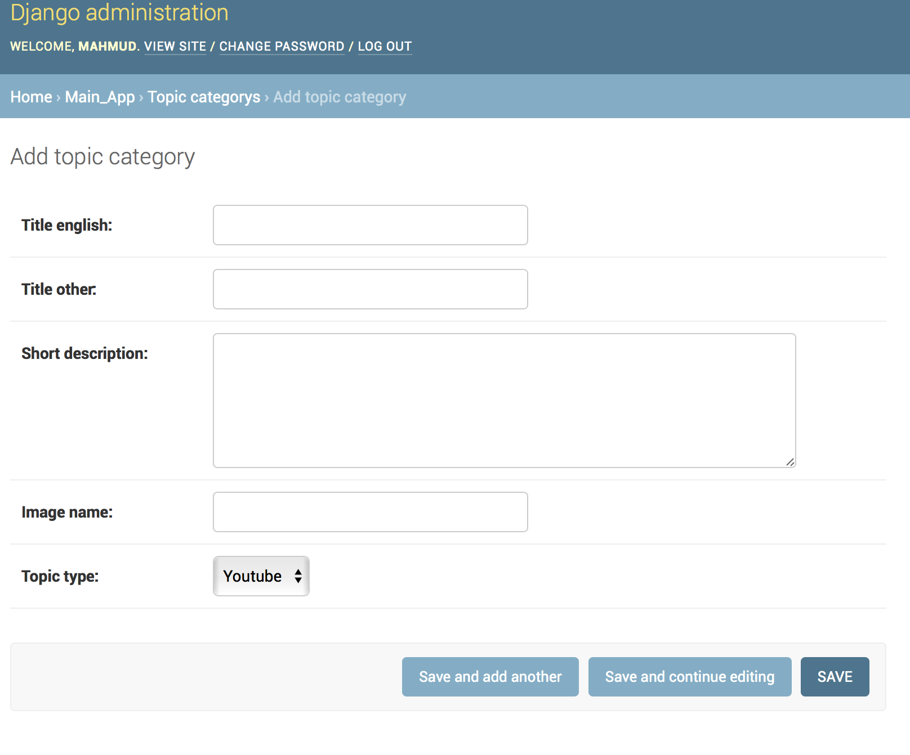
</p>	

Now fill the form for our demo purpose. In later you can modify/remove/add anything according to your requirments. After filling, SAVE the form.

| Column  	|  Data 	|
|---	    |---	|
|  Title English 	|   Python Beginner	|
|  Title Other 	|   পাইথন বিগিনার	|
|  Short Description 	|   পাইথন দিয়ে আমরা একটা ওয়েব অ‍্যাপ বানাই।	|
|  Image Name	|   py-beg.png	|
|  Topic Type 	|   Youtube	|

 py-beg.png image already stored in projects djangodemo/static/img/py-beg.png. So if you want to use other image, please put that on this directory and mention the name in the form.
 
 5. Now go to Home › Main_App and click [+ Add] in Topic Contents
 
 You will see the following form. Fill with some data like the demo and click SAVE. 
 
 * Url is used for Blog Post link, so for youtube no need. 
 * Tag is optional as well. If you put tag, it will be shown in the home page playlist. 
 * Order is used to rank list item accordingly.
 
<p align="center">
    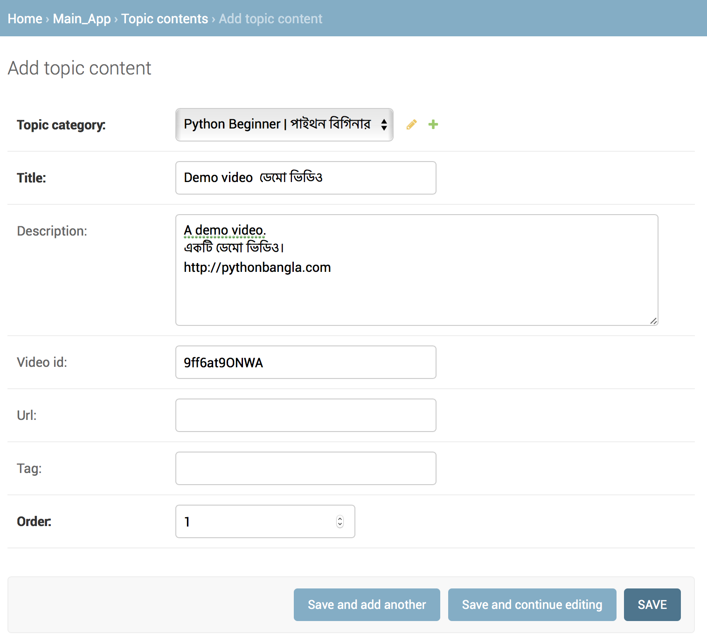
</p>
 
 6. Now visit http://127.0.0.1:8000 again 
 
 You will see the following web page
 
 <p align="center">
    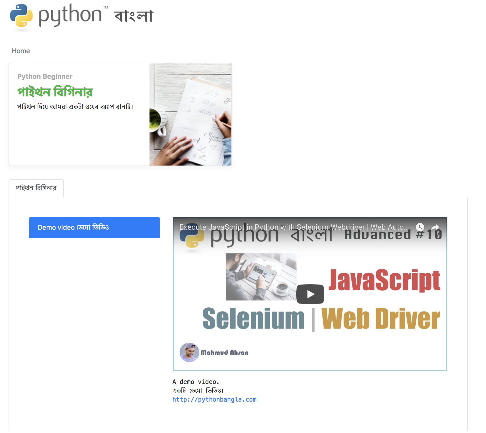
</p>

7. To publish URL links like the following example
 
 <p align="center">
    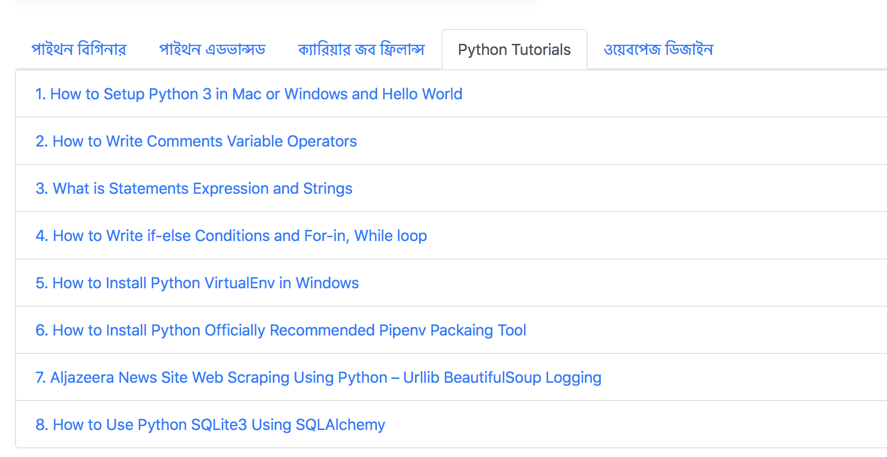
 </p>
 
 * Add a topic category and set the Topic Type URL
 
 <p align="center">
    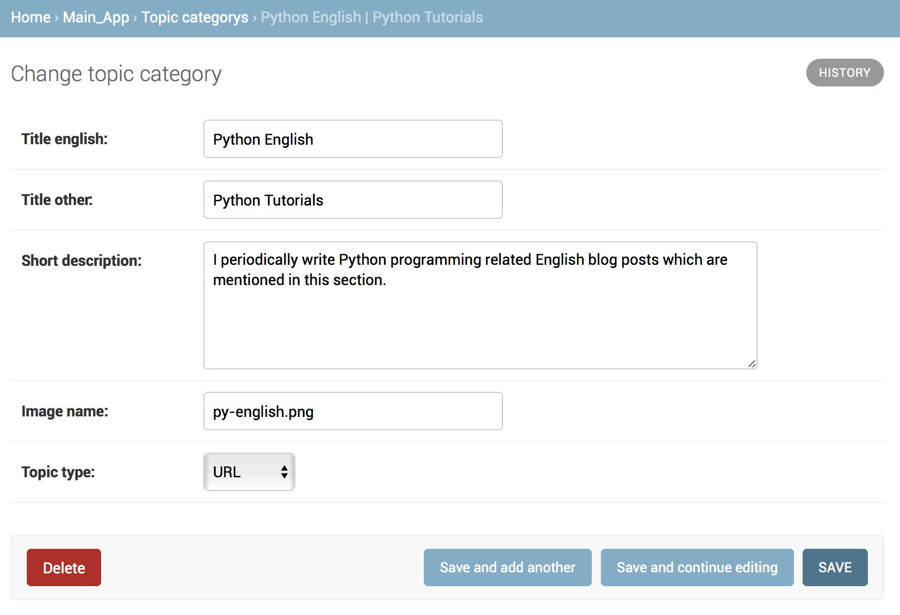
 </p>

* Add topic content and provide Title and URL

 <p align="center">
    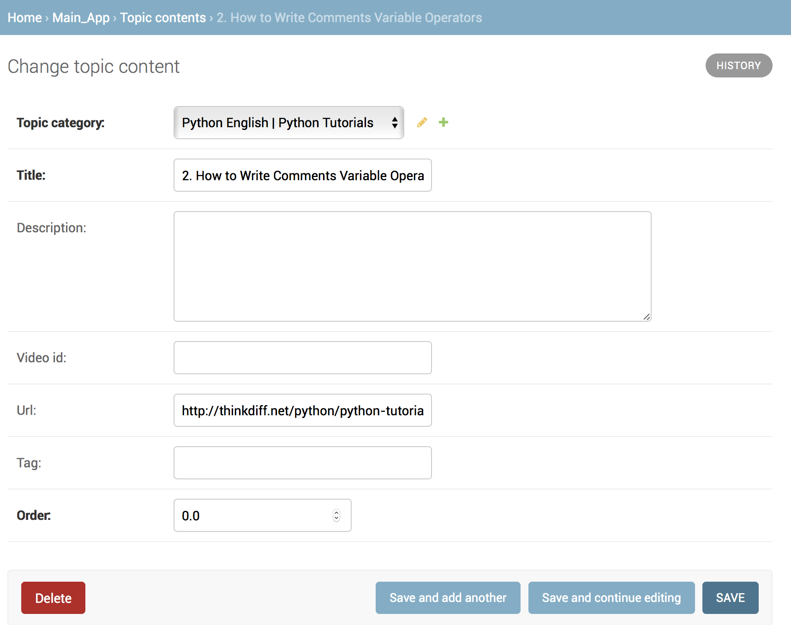
 </p>

Now visit http://127.0.0.1:8000 again to see the updates

#### Social Links

1. To add social links like facebook, twitter etc

<p align="center">
    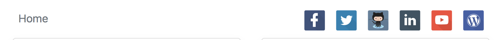
 </p>
 
 * Add item in Social Link table. If you don't provide any link, nothing will appear at top. By default the social icons are shown from djangodemo/static/img/social dirs
 
 <p align="center">
    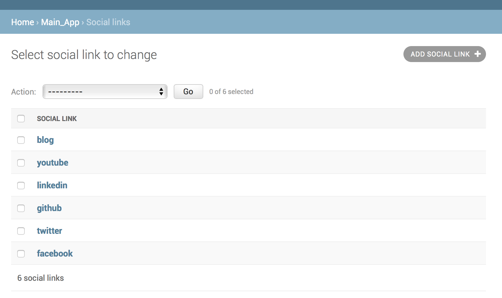
 </p>

#### JavaScript code like Google analytics or Google adsense code can be pushed within head tags 

* To do this add site option and paste javascript code in header section
* Only create one field in this table and add as many javascript code you want
* Also provide Title, Meta Author and Meta Description fields to show them in your site's html page

 <p align="center">
    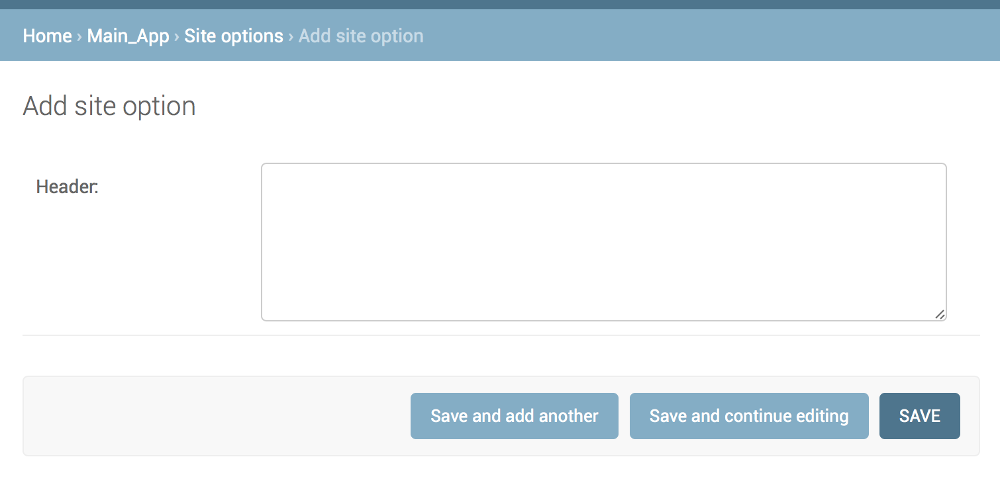
 </p>

## Setup Amazon S3 CDN to upload static content 
Django by default doesn't support serving static files in production. So the best and recommended way to upload static files in CDN network. In this case, I like Amazon S3 CDN and its super easy to use.

1. First you need to create a [Amazon Aws](https://aws.amazon.com) account
2. You have to create S3 bucket/container. To know how to proceed [follow this tutorial](https://simpleisbetterthancomplex.com/tutorial/2017/08/01/how-to-setup-amazon-s3-in-a-django-project.html)

2. Install two new libraries

```shell
pipenv install boto3
pipenv install django-storages
```

3. Updates project's settings.py file

* Add 'storage' above the app within INSTALLED_APPS

```Python
INSTALLED_APPS = [
    ...,
    'storages',
    'main_app'
]
```
* At the bottom of setting.py write and update the following codes and fill the ID, KEY, BUCKET_NAME from your account. 
* Also special notice AWS_S3_CUSTOM_DOMAIN this part. If you create different location for your bucket, you have to update it s3.us-east-2.amazonaws.com and have to give proper location

```Python
AWS_ACCESS_KEY_ID = ''
AWS_SECRET_ACCESS_KEY = ''
AWS_STORAGE_BUCKET_NAME = ''
AWS_S3_CUSTOM_DOMAIN = 's3.us-east-2.amazonaws.com/%s' % AWS_STORAGE_BUCKET_NAME
AWS_S3_OBJECT_PARAMETERS = {
'CacheControl': 'max-age=86400',
}
AWS_LOCATION = 'static'

STATICFILES_DIRS = [
os.path.join(BASE_DIR, 'static'),
]
STATIC_URL = 'https://%s/%s/' % (AWS_S3_CUSTOM_DOMAIN, AWS_LOCATION)
STATICFILES_STORAGE = 'storages.backends.s3boto3.S3Boto3Storage'
```

* Now run the following command to automatically upload your project static files to Amazon S3

```shell
python3 manage.py collectstatic
```

* If you visit http://127.0.0.1:8000 in your browser, now all the static content will be served from amazon S3 not from your local dir.

## Setup And Running in Heroku without static content 

Well now finally we can deploy our project in web server. For me, I found it is quite easy to use [Heroku](https://www.heroku.com) one of the popular python app hosting site. [Heroku](https://www.heroku.com) also has free tier package. So you can upload any python web project there, test and if satisified you can upgrade to premium service. Then you can add your own domain. Also heroku provides PostgreSQL service as well. 

1. Create an account on [Heroku](https://www.heroku.com)
2. Install Heroku CLI (Command Line Interface) in your machine. Follow [heroku tutorial](https://devcenter.heroku.com/articles/heroku-cli#download-and-install)
3. Also I assume you have [git installed in your machine](https://git-scm.com/book/en/v2/Getting-Started-Installing-Git) and you can use git by typing commands in terminal/shell
4. Now create a new file named [Procfile](https://devcenter.heroku.com/articles/procfile)

```shell
touch Procfile
```
* Now open the Procfile in any editor and add the following code to specify heroku to use [Gunicorn](http://gunicorn.org) web server.

```shell
web: gunicorn pythonbangla_project.wsgi --log-file -
```

5. Install gunicorn in your machine

```shell
pipenv install gunicorn
```

6. Now run the following heroku commands in Terminal/Shell

* When asks for email/password, provide your heroku account credentials.
```shell
heroku login
```

* After login successfully, create a heroku project by

```shell
heroku create django-demo-2018 # if this name django-demo-2018 available you can use otherwise try different name
# OR
heroku create # it will generate a random name for heroku project
```

* Now run the following command to set heroku's git's remote url to your project name
```shell
heroku git:remote -a django-demo-2018 # in your case may be change django-demo-2018 to the name you selected or get randomly from heroku
```

* Now disable auto collection static files here i assume you are using Amazon S3 or other service
```shell
heroku config:set DISABLE_COLLECTSTATIC=1
```

#### Copy PostgreSQL configuration and update your django's settings.py Database section

* visit [heroku dashboard](https://dashboard.heroku.com/apps) click your app
* Then click Heroku Postgres within Installed add-ons section
* Then go to settings and click view database credentials
* Now copy those info and update your django project's settins.py DATABASES->Default section

* Add '*' in Allowed hosts in settings.py

```Python
DEBUG = False # first test it with False, if everythin runs successully then make it True, commit and push again
ALLOWED_HOSTS = ['*']
```

* Now run the following git commands to add your changes and commit them
```shell
git add -A
git commit -m "heroku config updated"
```

* Now push the code on heroku
```shell
git push heroku master 
# OR if you use a different git branch in your machine then run
git push heroku LOCAL_BRANCH_NAME:master 
```

* Finally start web process on heroku
```shell
heroku ps:scale web=1
```

* Now you can browse your heroku app in your web browser. If you got the name django-demo-2018 you can browse
https://django-demo-2018.herokuapp.com/
 
## Setup And Running in Heroku with static content

If you don't want to use Amazon S3 or other CDN service and want to server static contents from heroku then you can follow this way to solve the problem.

* Before following [Setup And Running in Heroku without static content](#setup-and-running-in-heroku-without-static-content) steps follow this:

1. Install the [whitenoise package](http://whitenoise.evans.io/en/stable/)
```shell
pipenv install whitenoise
```

2. Open settings.py and within INSTALLED_APP write whitenoise command between messages and staticfiles

```Python
'django.contrib.messages',
'whitenoise.runserver_nostatic', # whitenoise
'django.contrib.staticfiles',
'main_app'
```

3. In setting.py, within MIDDLEWARE add whitenoise between session and common
```Python
'django.contrib.sessions.middleware.SessionMiddleware',
'whitenoise.middleware.WhiteNoiseMiddleware', # whitenoise
'django.middleware.common.CommonMiddleware',
```

4. # In setting.py at the bottom add the following lines
```python
STATIC_ROOT = os.path.join(BASE_DIR, 'staticfiles') # new!
STATIC_URL = '/static/'
STATICFILES_DIRS = [os.path.join(BASE_DIR, 'static')]
STATICFILES_STORAGE = 'whitenoise.storage.CompressedManifestStaticFilesStorage' #new
```

5. If you already disabled collect static command then enable it
```shell
heroku config:unset DISABLE_COLLECTSTATIC=1
```

6. Now add and commit
```shell
git add -A
git commit -m "Whitenoise config added"
```

7. Now follow the steps described in here [Setup And Running in Heroku without static content](#setup-and-running-in-heroku-without-static-content) 

## How to force https in django

If your up the project in [heroku](https://www.heroku.com) and use their premium service and add a domain, [heroku](https://www.heroku.com) will automatically add a SSL so you can use https instead of http.

* To redirect https by default update djangodemo/pythonbangla_project/settings.py and at the end of the file add the following code

```Python
SECURE_SSL_REDIRECT = True
SESSION_COOKIE_SECURE = True
CSRF_COOKIE_SECURE = True
```

## Contribution
If you want to contribute on this project, you're welcome to fork the project and submit a pull request. Just try to not break the existing things.

## Questions or feedback?

Feel free to [open an issue](https://github.com/mahmudahsan/pythonbangla.com/issues/new), or find me [@mahmudahsan on Twitter](https://twitter.com/mahmudahsan).
